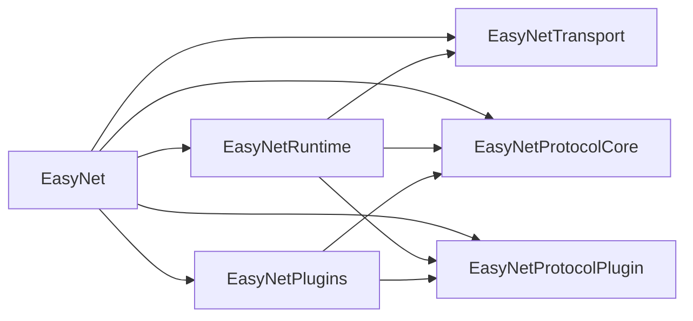
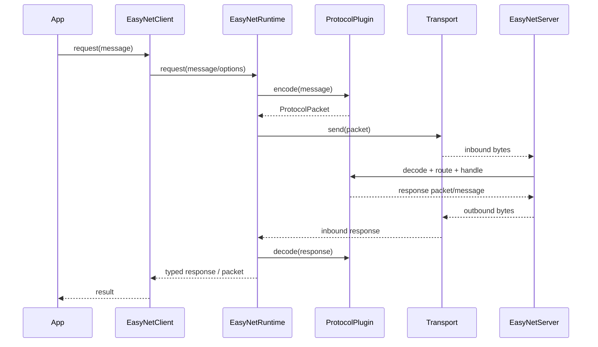

[](https://github.com/sweetloser/EasyNet/actions/workflows/ci.yml)
[](https://github.com/sweetloser/EasyNet/releases)
[](https://github.com/sweetloser/EasyNet/blob/main/LICENSE)
[](https://www.swift.org/)
[](https://github.com/sweetloser/EasyNet)

# EasyNet

EasyNet 是一个基于 SwiftNIO 的分层通信 SDK，提供了传输层、协议层、插件层和运行时编排层的清晰划分，适合构建自定义 TCP 协议、插件化消息处理链路以及带请求响应语义的通信客户端/服务端。

当前版本已经可以作为一个可运行、可测试、可扩展的 Swift Package 使用，并附带终端 demo 作为最小接入示例。

## 特性

- 基于 SwiftNIO 的 TCP Client / Server
- 中性的 `ProtocolPacket` / `ProtocolHeader` 协议包模型
- 可替换的 `PacketCodec`
- 可复用的 payload serializer
- 插件式消息映射、路由处理和生命周期扩展
- 统一的客户端 / 服务端运行时事件流
- 协议包级发送与请求
- 消息级发送与请求
- 请求自动分配 `session`
- 可选请求超时
- 可配置请求重试
- 客户端自动重连
- 客户端主动心跳
- 客户端流量监控
- 服务端流量监控
- typed response 解码
- 内置系统插件与终端文本示例插件

## 环境要求

- Swift 6.2
- macOS 12+
- iOS 13+

## 安装

在你的 `Package.swift` 中添加依赖：

```swift
dependencies: [
    .package(url: "https://github.com/sweetloser/EasyNet.git", exact: "0.1.0")
]
```

然后在 target 中引入产品：

```swift
dependencies: [
    .product(name: "EasyNet", package: "EasyNet")
]
```

如果你当前是在仓库本地直接使用：

```bash
swift build
swift test
```

## 架构图

### 模块关系



### 请求处理流程



## 模块结构

当前 package 包含以下模块：

- `EasyNetTransport`
  - 负责 TCP 连接、连接状态、原始字节收发
- `EasyNetProtocolCore`
  - 负责 `ProtocolPacket`、`ProtocolHeader`、`PacketCodec`、payload serializer
- `EasyNetProtocolPlugin`
  - 负责插件协议、映射器、处理器、生命周期钩子与插件上下文
- `EasyNetRuntime`
  - 负责请求响应编排、运行时事件、请求 orchestration、服务端连接生命周期、连接级入站解码状态、服务端入站管线、入站分发、出站发送
- `EasyNetPlugins`
  - 提供当前内置插件
- `EasyNet`
  - 对外门面 API，统一导出主要能力

## 核心概念

### Transport

传输层只处理连接和字节流，不直接处理业务消息。

### ProtocolPacket

协议核心使用 `ProtocolPacket` 作为统一包模型：

```swift
public struct ProtocolPacket {
    public var header: ProtocolHeader
    public var payload: [UInt8]
}
```

`header` 中包含：

- `magic`
- `version`
- `codec`
- `command`
- `session`
- `flags`
- `sequence`
- `status`
- `checksum`
- `length`

### Plugin

插件层通过以下抽象扩展协议能力：

- `ProtocolPlugin`
- `PacketMapper`
- `PacketRouteHandler`
- `PluginLifecycleHook`

这意味着业务消息的编码、解码、路由和生命周期监听都可以按插件拆分。

### RuntimeEvent

客户端和服务端统一暴露：

```swift
public enum RuntimeEvent {
    case stateChanged(ConnectionState)
    case connected(ConnectionContext)
    case disconnected(ConnectionContext?, ConnectionCloseReason)
    case packet(ConnectionContext?, ProtocolPacket)
    case message(ConnectionContext?, any DomainMessage)
    case traffic(ConnectionContext?, RuntimeTrafficStats)
    case failure(Error)
}
```

上层可以同时监听：

- 连接状态变化
- 原始协议包
- 插件解码后的领域消息
- 运行时错误

也可以通过便捷访问器统一读取事件内容，例如：

下面的示例仍然沿用 `TerminalTextMessage` 作为演示消息类型：

```swift
for await event in client.events {
    if let stats = event.trafficStats {
        print("traffic read=\\(stats.readKBps)KB/s write=\\(stats.writeKBps)KB/s")
    }

    if let message = event.messageValue as? TerminalTextMessage {
        print("message: \\(message.text)")
    }

    if let error = event.error {
        print("event error: \\(error)")
    }
}
```

## 快速开始

### 创建 Client

```swift
import EasyNet

let client = try EasyNetBuilder()
    .useTCPClient(host: "127.0.0.1", port: 9999)
    .addPlugin(TerminalTextPlugin())
    .buildClient()
```

启用自动重连：

```swift
client.enableAutoReconnect(
    EasyNetReconnectOptions(
        maxAttempts: 5,
        backoff: .exponential(initialDelay: 0.5, multiplier: 2, maxDelay: 5),
        jitter: .ratio(0.2)
    )
)
```

启用主动心跳：

```swift
client.enableHeartbeat(
    EasyNetHeartbeatOptions(
        interval: 30,
        timeout: 5,
        maxConsecutiveFailures: 3
    )
)
```

启用流量监控：

```swift
client.enableTrafficMonitor(
    EasyNetTrafficMonitorOptions(interval: 1)
)
```

服务端也可以启用流量监控：

```swift
server.enableTrafficMonitor(
    EasyNetTrafficMonitorOptions(interval: 1)
)
```

统一配置服务端观测能力：

```swift
server.configureObservability(
    EasyNetServerObservabilityOptions(
        trafficMonitor: EasyNetTrafficMonitorOptions(interval: 1)
    )
)
```

统一配置客户端观测能力：

```swift
client.configureObservability(
    EasyNetClientObservabilityOptions(
        reconnect: EasyNetReconnectOptions(
            maxAttempts: 5,
            backoff: .exponential(initialDelay: 0.5, multiplier: 2, maxDelay: 5),
            jitter: .ratio(0.2)
        ),
        heartbeat: EasyNetHeartbeatOptions(
            interval: 30,
            timeout: 5,
            maxConsecutiveFailures: 3
        ),
        trafficMonitor: EasyNetTrafficMonitorOptions(interval: 1)
    )
)
```

`EasyNetBuilder` 会在 `buildClient()` / `buildServer()` 时对当前配置和插件列表做一次快照；后续继续修改 builder，不会反向影响已经构建出的 client 或 server。

如果你希望每次 `build...()` 时都创建全新的插件实例，也可以使用：

```swift
let builder = EasyNetBuilder()
    .useTCPClient(host: "127.0.0.1", port: 9999)
    .addPluginFactory { TerminalTextPlugin() }
```

启动连接：

```swift
client.start()
```

### 创建 Server

```swift
import EasyNet

let server = try EasyNetBuilder()
    .useTCPServer(host: "127.0.0.1", port: 9999)
    .addPlugin(TerminalTextPlugin())
    .buildServer()

try await server.start()
```

停止服务端：

```swift
server.stop()
```

### 监听事件

```swift
Task {
    for await event in client.events {
        switch event {
        case .stateChanged(let state):
            print("state:", state)
        case .connected(let context):
            print("connected:", context)
        case .packet(_, let packet):
            print("packet:", packet)
        case .message(_, let message):
            print("message:", message)
        case .disconnected(_, let reason):
            print("disconnected:", reason)
        case .failure(let error):
            print("error:", error)
        }
    }
}
```

## 使用方式

推荐优先使用以下主入口：

- 生命周期：`start()` / `stop()`
- 协议包发送：`send(packet:)`
- 协议包请求：`request(packet:...)`
- 消息发送：`send(message:)`
- 消息请求：`request(message:...)`
- 观测配置：`configureObservability(...)`

以下消息级示例默认使用 `TerminalTextMessage` 作为演示消息模型，仅用于说明调用方式。

### 推荐 API 清单

如果你是首次接入，建议优先围绕以下公开类型与入口使用：

- 构建入口：`EasyNetBuilder`
- 客户端门面：`EasyNetClient`
- 服务端门面：`EasyNetServer`
- 协议包模型：`ProtocolPacket` / `ProtocolHeader`
- 请求配置：`EasyNetRequestOptions`
- 客户端观测配置：`EasyNetClientObservabilityOptions`
- 服务端观测配置：`EasyNetServerObservabilityOptions`
- 运行时事件：`RuntimeEvent`

推荐优先通过 `EasyNetBuilder` 构建 client / server，而不是直接面向 runtime 构造类型编排依赖。

### 发送消息（示例消息）

```swift
try await client.send(
    message: TerminalTextMessage(text: "hello", magic: .request)
)
```

### 发送协议包

```swift
let packet = ProtocolPacket(
    header: ProtocolHeader(magic: .request, command: 0x1001),
    payload: []
)

try await client.send(packet: packet)
```

### 服务端向指定连接发送协议包

```swift
try await server.send(packet: packet, to: connectionID)
```

### 服务端向指定连接发送消息（示例消息）

```swift
try await server.send(
    message: TerminalTextMessage(text: "hello", magic: .event),
    to: connectionID
)
```

### 请求协议包

如果请求包的 `session` 为 `0`，runtime 会自动分配一个可用 `session`：

```swift
let requestPacket = ProtocolPacket(
    header: ProtocolHeader(magic: .request, command: 0x1001),
    payload: []
)

let responsePacket = try await client.request(packet: requestPacket)
```

### 请求协议包并指定超时

```swift
let responsePacket = try await client.request(packet: requestPacket, timeout: 5)
```

### 使用请求选项

如果需要同时配置超时、重试次数和重试策略，可以使用 `EasyNetRequestOptions`：

```swift
let options = EasyNetRequestOptions(
    timeout: 5,
    retryCount: 2,
    retryDelay: 0.5
)

let responsePacket = try await client.request(packet: requestPacket, options: options)
```

### 使用显式 retry policy

如果你需要更明确地控制“什么错误可以重试”和“如何退避”，可以使用显式策略：

```swift
let options = EasyNetRequestOptions(
    timeout: 5,
    retryCount: 2,
    retryCondition: .timeoutOnly,
    retryBackoff: .fixed(0.5)
)

let responsePacket = try await client.request(packet: requestPacket, options: options)
```

### 使用指数退避

如果你希望每次重试的等待时间逐步增加，可以使用指数退避：

```swift
let options = EasyNetRequestOptions(
    timeout: 5,
    retryCount: 3,
    retryCondition: .timeoutOnly,
    retryBackoff: .exponential(
        initialDelay: 0.2,
        multiplier: 2,
        maxDelay: 1.0
    )
)
```

### 使用 jitter

如果你希望在退避等待时间上增加抖动，降低多个请求在相同时间点重试的概率，可以配置 `retryJitter`：

```swift
let options = EasyNetRequestOptions(
    timeout: 5,
    retryCount: 3,
    retryCondition: .timeoutOnly,
    retryBackoff: .exponential(
        initialDelay: 0.2,
        multiplier: 2,
        maxDelay: 1.0
    ),
    retryJitter: .ratio(0.2)
)
```

### 请求消息（示例消息）

```swift
let responsePacket = try await client.request(
    message: TerminalTextMessage(text: "hello", magic: .request)
)
```

### 请求消息并指定超时（示例消息）

```swift
let responsePacket = try await client.request(
    message: TerminalTextMessage(text: "hello", magic: .request),
    timeout: 5
)
```

### 获取 typed response（示例消息）

如果当前插件支持把响应包解码为目标消息类型，可以直接拿到 typed response：

```swift
let response = try await client.request(
    message: TerminalTextMessage(text: "hello", magic: .request),
    as: TerminalTextMessage.self
)
```

### 获取 typed response 并指定超时（示例消息）

```swift
let response = try await client.request(
    message: TerminalTextMessage(text: "hello", magic: .request),
    as: TerminalTextMessage.self,
    timeout: 5
)
```

### 获取 typed response 并使用重试选项（示例消息）

```swift
let options = EasyNetRequestOptions(
    timeout: 5,
    retryCount: 2,
    retryDelay: 0.5
)

let response = try await client.request(
    message: TerminalTextMessage(text: "hello", magic: .request),
    as: TerminalTextMessage.self,
    options: options
)
```

### 兼容别名

以下接口当前仍然保留，用于兼容旧写法，但不作为推荐主入口：

- `connect()` / `disconnect()`
  - 等价于 `start()` / `stop()`
- `request(_ packet: ...)`
  - 推荐改用 `request(packet: ...)`

## 请求与错误语义

当前请求链路支持：

- 自动分配 request `session`
- 收到响应后按 `session` 自动关联
- 超时后抛出 `RuntimeRequestError.timeout`
- 失败后按配置进行重试
- 响应包无法映射为消息时抛出 `RuntimeRequestError.responseNotMapped`
- 响应消息类型与预期类型不一致时抛出 `RuntimeRequestError.unexpectedResponseType`

当前客户端还支持：

- 基于 request-response 的主动心跳
- 心跳连续失败达到阈值后抛出 `RuntimeHeartbeatError.lostResponses`
- 通过 runtime 事件流输出流量统计快照
- 通过 `configureObservability(...)` 一次性配置 reconnect / heartbeat / traffic
- 服务端支持通过同一套 `traffic` 事件输出整体流量统计
- 服务端支持通过 `configureObservability(...)` 统一配置 observability

当前重试语义为：

- `retryCount = 0` 表示不重试
- `retryCount = N` 表示首次失败后最多额外重试 `N` 次
- `retryCondition = .allFailures` 表示任意请求失败都可以重试
- `retryCondition = .timeoutOnly` 表示只对超时进行重试
- `retryBackoff = .immediate` 表示立即重试
- `retryBackoff = .fixed(x)` 表示每次重试前等待 `x` 秒
- `retryBackoff = .exponential(initialDelay:multiplier:maxDelay:)` 表示按指数退避等待，并可设置最大等待上限
- `retryJitter = .none` 表示不加抖动
- `retryJitter = .ratio(x)` 表示在当前退避时间上下按比例加入抖动
- 当前重试会复用同一个逻辑请求包和同一个 `session`

## 当前内置插件

当前 package 内置以下插件：

- 系统插件：`SystemHandshakePlugin`、`SystemHeartbeatPlugin`
- 示例插件：`TerminalTextPlugin`

推荐口径：

- `SystemHandshakePlugin`、`SystemHeartbeatPlugin` 主要作为系统级协作插件使用，通常只需要安装插件本身，不必在业务代码中直接依赖 `HandshakeMessage` 或 `HeartbeatMessage`
- `TerminalTextPlugin`、`TerminalTextMessage` 主要用于 demo、测试和示例接入，不建议直接作为正式业务协议模型复用

其中 `TerminalTextPlugin` 是当前最完整的示例插件，覆盖：

- `DomainMessage <-> ProtocolPacket` 映射
- 请求消息路由处理
- 自动回显响应
- demo 与测试接入

## 定义自己的消息与插件

在正式业务接入中，推荐你定义自己的 `DomainMessage` 与 `ProtocolPlugin`，而不是直接复用 `TerminalTextMessage`。

下面是一个最小示例：

```swift
import EasyNet

struct ChatTextMessage: DomainMessage {
    let text: String
    let session: UInt16

    init(text: String, session: UInt16 = 0) {
        self.text = text
        self.session = session
    }
}

final class ChatTextPlugin: ProtocolPlugin, PacketMapper, PacketRouteHandler {
    let key = "chat.text"
    private let serializer = JSONPayloadSerializer()

    func setup(in registry: PluginRegistry) {
        registry.register(mapper: self)
        registry.register(handler: self)
    }

    func decode(_ packet: ProtocolPacket) throws -> (any DomainMessage)? {
        guard packet.header.command == 0x3001 else {
            return nil
        }

        let payload = try serializer.decode(ChatTextPayload.self, from: packet.payload)
        return ChatTextMessage(text: payload.text, session: packet.header.session)
    }

    func encode(_ message: any DomainMessage) throws -> ProtocolPacket? {
        guard let message = message as? ChatTextMessage else {
            return nil
        }

        let payload = try serializer.encode(ChatTextPayload(text: message.text))
        let header = ProtocolHeader(
            magic: .request,
            version: 1,
            codec: .json,
            command: 0x3001,
            session: message.session
        )
        return ProtocolPacket(header: header, payload: payload)
    }

    func canHandle(_ packet: ProtocolPacket) -> Bool {
        packet.header.command == 0x3001 && packet.header.magic == .request
    }

    func handle(_ packet: ProtocolPacket, context: PluginContext) async throws {
        guard let message = try decode(packet) as? ChatTextMessage else {
            return
        }

        try await context.send(
            message: ChatTextMessage(
                text: "ack: \\(message.text)",
                session: packet.header.session
            )
        )
    }
}

private struct ChatTextPayload: Codable {
    let text: String
}
```

然后通过 `EasyNetBuilder` 安装自己的插件：

```swift
let client = try EasyNetBuilder()
    .useTCPClient(host: "127.0.0.1", port: 9999)
    .addPlugin(ChatTextPlugin())
    .buildClient()
```

### 自定义消息插件完整用例

下面给出一个更完整的业务接入示例，演示同一个自定义插件如何同时安装到 server 和 client，并结合请求接口与事件流一起使用。

仓库中的 terminal demo 也已经内置了一个同类业务示例插件 `DemoChatPlugin`，你可以直接运行 demo 命令体验“自定义消息 -> 插件编解码 -> typed response”这条链路。

服务端：

```swift
import EasyNet

let server = try EasyNetBuilder()
    .useTCPServer(host: "127.0.0.1", port: 9999)
    .addPlugin(ChatTextPlugin())
    .buildServer()

Task {
    for await event in server.events {
        if let message = event.messageValue as? ChatTextMessage {
            print("server received chat text: \(message.text)")
        }

        if let error = event.error {
            print("server runtime error: \(error)")
        }
    }
}

try await server.start()
```

客户端：

```swift
import EasyNet

let client = try EasyNetBuilder()
    .useTCPClient(host: "127.0.0.1", port: 9999)
    .addPlugin(ChatTextPlugin())
    .buildClient()

Task {
    for await event in client.events {
        if let message = event.messageValue as? ChatTextMessage {
            print("client observed chat text: \(message.text)")
        }

        if let error = event.error {
            print("client runtime error: \(error)")
        }
    }
}

client.start()
```

发送请求并获取 typed response：

```swift
let response = try await client.request(
    message: ChatTextMessage(text: "hello business plugin"),
    as: ChatTextMessage.self
)

print(response.text) // ack: hello business plugin
```

如果你不需要 typed response，也可以只发送消息，让业务侧统一从事件流中消费插件解码后的 `ChatTextMessage`：

```swift
try await client.send(
    message: ChatTextMessage(text: "fire-and-forget")
)
```

业务接入建议：

- 为每类业务消息分配稳定的 `command`
- 让 `PacketMapper` 只负责编解码，不承载业务状态
- 让 `PacketRouteHandler` 负责 request 处理与 response 发送
- 优先把业务模型定义在你自己的模块中，而不是依赖示例消息类型

## 运行 Demo

### 启动服务端

```bash
swift run EasyNetTerminalServerDemo 9999
```

### 启动客户端

```bash
swift run EasyNetTerminalClientDemo 127.0.0.1 9999
```

### 自动发送一条消息

```bash
swift run EasyNetTerminalClientDemo 127.0.0.1 9999 --message hello
```

### 批量发送消息

```bash
swift run EasyNetTerminalClientDemo 127.0.0.1 9999 --messages 'hello|world|bye'
```

### 指定客户端等待超时

```bash
swift run EasyNetTerminalClientDemo 127.0.0.1 9999 --message hello --timeout 5
```

### 使用自定义消息插件发送业务消息

```bash
swift run EasyNetTerminalClientDemo 127.0.0.1 9999 --custom-message hello-business --custom-room ops
```

服务端仍然使用同一个 demo 入口：

```bash
swift run EasyNetTerminalServerDemo 9999
```

执行后可以看到：

- client 通过 `DemoChatMessage` 发起业务请求
- server 通过 `DemoChatPlugin` 解码并打印业务消息
- client 通过 typed response 收到 `ack: ...` 响应

## 测试

执行：

```bash
swift test
```

当前测试覆盖以下核心链路：

- `ProtocolPacket` 编解码
- `TerminalTextPlugin` 编码与解码
- 插件处理器回显
- runtime 协议包级 request-response
- runtime 消息级 request-response
- runtime 自动 `session` 分配
- runtime 请求超时
- runtime 请求重试
- runtime typed response 解码
- 终端 demo 集成行为

## 适用场景

EasyNet 当前适合：

- 自定义 TCP 协议客户端
- 自定义 TCP 协议服务端
- 需要插件化消息编解码与路由的通信 SDK
- 需要统一事件流和请求响应编排的 Swift 网络项目
- 需要自动重连能力的 TCP 客户端 SDK
